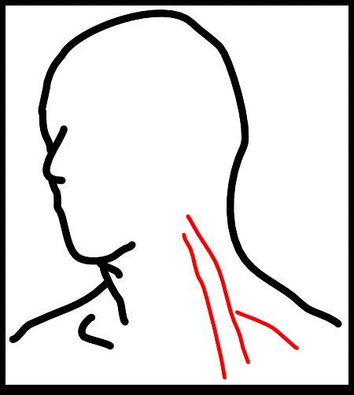
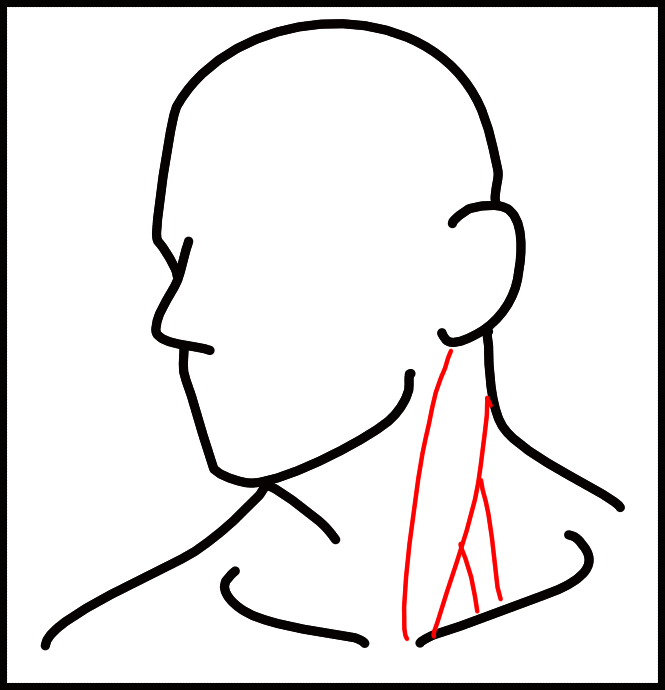

Muscle tension can cause an insane amount of symptoms in the head and neck region:  

 Blurred Vision  
 Dizziness  
 Migraine Headaches  
 Nausea  
 Visual Disturbances  

Over-tense muscles can be caused by muscular imbalances, poor posture, or even suddenly-increased activity. Or, by things you put in your body like nicotine, alcohol, [caffeine](https://www.davidwrites.xyz/notes/caffeineblues/), certain medications, or sugar. 

To add to the list: emotional distress, nutritional deficiencies, coughing, allergic reactions, chemical withdrawal, and physical trauma. 

Muscle tension in the jaw, upper back, and neck muscles are the most common causes for the symptoms above. Pain in one area is often caused by a tight muscle in a different area. 

Upper back and shoulder tension causes neck pain, then your neck muscles cause headaches. 

Obviously, pain, headaches, and vertigo can have other causes besides tight muscles. But up to 80-90% of our physical pain is caused by Myofascial dysfunction. So it's worth starting here first. 

## The fix: self massage
Doing self massage is great because you can do it daily and for free. You can also use tools like [Therapy Balls](https://www.tuneupfitness.com/shop/massage-balls), lacrosse balls, or a Theracane to save your hands. 

Find a sore or tense muscle, then do 10 slow strokes per spot. Work bad areas multiple times per day. Aim for a 5/10 on the "Good pain" scale. 

If you suddenly find yourself holding your breath, then you are pressing too hard. Breath holding signals the brain that you are in trouble and can make your muscles tense up even more. 

Avoid anything that feels weird or gives you "bad pain". And as always, consult with your doctor before you do any of this. When in doubt, go see a professional.

[Jill Miller](https://www.youtube.com/@TuneUpFitness) has a lot of good videos on techniques you can use to massage different muscle groups. Each muscle listed below has the muscle highlighted in red. That is the area you are aiming to massage. 

## Tight muscles and their symptoms
### Scalenes

  


**Symptoms of tight scalene muscles**  
 Numbness  
 Tingling  
 Weird sensations in chest, shoulder, arm, neck, and hand  

Tight scalenes can pull the first rib up into the collar bone and squeeze blood vessels  and nerves. Restricted bloodflow and nerve disturbance can cause pain, burning, numbness, and tingling all the way down the arm and hands (thoracic outlet syndrome).

It's worth starting here because scalenes can cause so many other muscles to also be tense.

**Common causes for tight scalene muscles**  
 Poor breathing mechanics (breathing too much with accessory breathing muscles instead of diaphragm)  
 Hyperventilating   
 Heavy coughing or sneezing  
 Emotional tension  
 Working long hours with hands out in front of you 
 Stress from caffeine, alcohol, or nicotine use

**What you should do**
Work on your [posture](https://www.youtube.com/watch?v=OQhqv_0d-nw), such as keeping your head center, not slouching, etc. And practice diaphragm breathing with [deadbugs](https://nick-e.com/deadbug/). Meditation, therapy, or journaling may help with emotional distress. Quit using caffeine, alcohol, nicotine, etc. 

Massage the muscles in the front and side of the neck, being careful to avoid pulses and anything that feels weird. Do this throughout the day to relax these muscles. 

### Sternocleidomastoid 

  


**Symptoms of tight sternocleidomastoid muscles**  
 Vertigo  
 Blurred vision  
 Dizziness  
 Migraines  
 Nausea  
 Visual disturbances  

Tension here can cause dizziness that can occur suddenly or last for minutes, hours, or days. And often given a diagnosis of vertigo.

Sternocleidomastoid muscles help with spatial orientation that helps your brain keep track of the position of your head. Confusing signals are sent to the brain when there is tension here. 

This can also cause a referred spasm in the muscle that surrounds the eye. Leading to blurry vision.

**Common causes for tight sternocleidomastoid muscles**  
 Bad head posture  
 Other trigger points or muscle imbalance  
 Whiplash  
 Using breath accessory muscles instead of diaphragm.  

**What you should do**
Pinch and rub the big muscle you feel on the front of your neck when you turn your head. And work on your breathing and posture. 
### Trapezius

  


**Symptoms of tight trapezius muscles**  
 Migraines   
 Sore neck  

**Common causes for tight trapezius muscles**    
 Slouched posture while seated  
 Forward head  
 Tight pecks  
 Tight abs  
 Working long hours with hands out in front of you   
 Emotional tension that keeps your shoulders up  

**What you should do**
Purposefully let your shoulders drop down multiple times during the day. This area is good to massage with a lacrosse ball up against a wall.

### Splenius cervicis

  


**Symptoms of tight splenius cervicis muscles**  
 Blurred vision  
 Migraines  
 Visual disturbances  

This muscle bends, flexes, and twists the neck. 

**Common causes for tight splenius cervicis muscles**    
 Lounging with head propped at an angle  
 Pulling excessive weight    
 Cold exposure with relaxed breathing    
 Forward-­head posture   
 Whiplash  

**What you should do**  
Fix underlying posture issues and [learn to relax](https://www.health.harvard.edu/staying-healthy/try-this-progressive-muscle-relaxation-for-sleep).  Another lacrosse-ball-to-wall spot.

### Suboccipital

  


**Symptoms of tight suboccipital muscles**  
 Blurred vision  
 Migraines  
 Visual disturbances  

**Common causes for tight suboccipital muscles**   
 Whiplash    
 Forward-head posture    
 Emotional tension    
 Postural stresses    
 Worry  

**What you should do**  
Work on your posture and try to learn healthy ways to cope with stress. Use your fingers to rub this area throughout the day.
### Temporalis

  


**Symptoms of tight temporalis muscles**    
 Migraines    

**Common causes for tight temporalis muscles**  
 Trauma  
 Teeth grinding from caffeine use  
 Forward head posture  

**What you should do**  
You can massage this area throughout the day with your fingers. 

**Sources:**
- https://books.google.com/books/about/Travell_Simons_Myofascial_Pain_and_Dysfu.html?id=sU0XupX7DGsC
- https://www.google.com/books/edition/The_Trigger_Point_Therapy_Workbook/DLb7ShX-gskC?hl=en&gbpv=0
- https://www.google.com/books/edition/Becoming_a_Supple_Leopard_2nd_Edition/x4GQEAAAQBAJ?hl=en