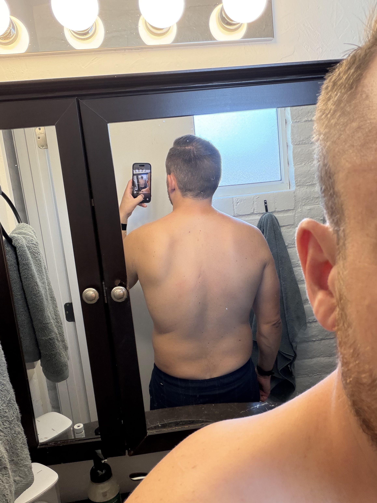
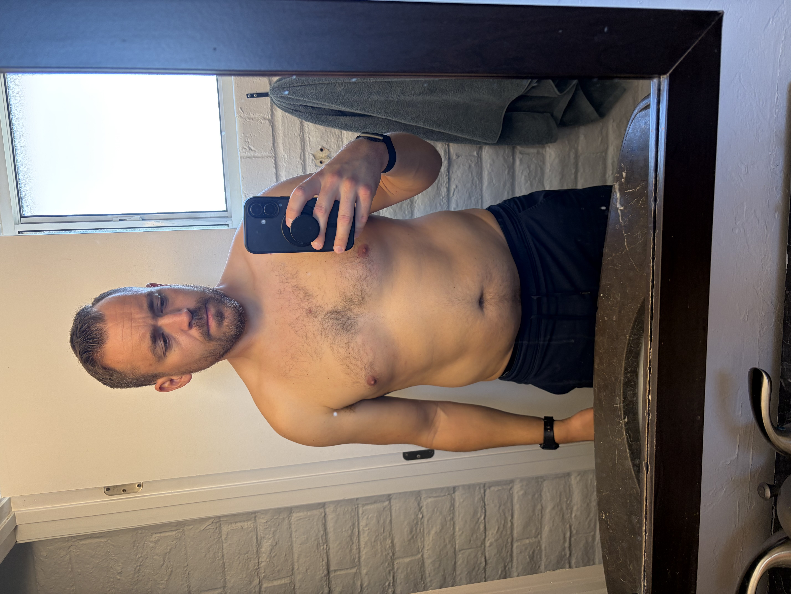
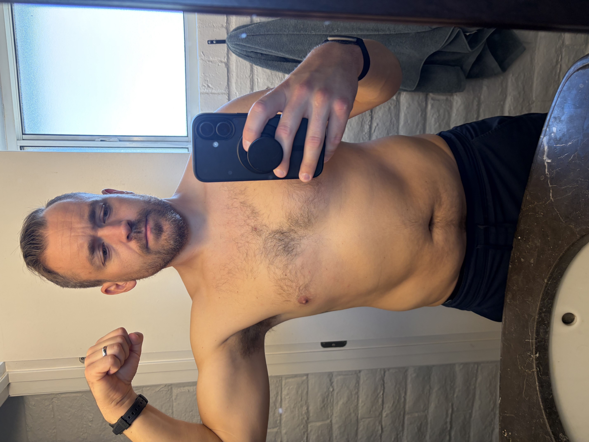
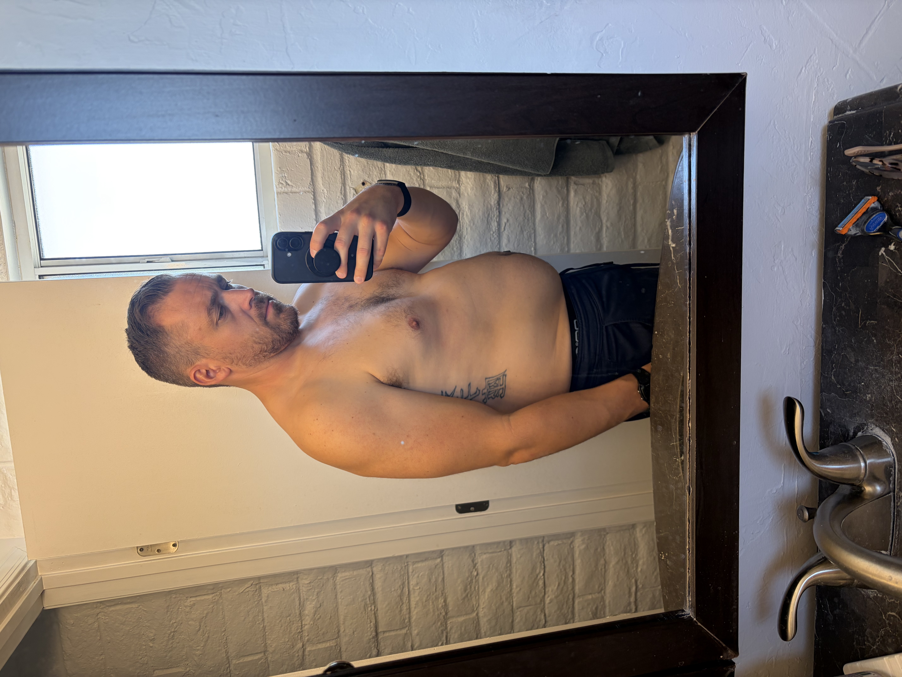
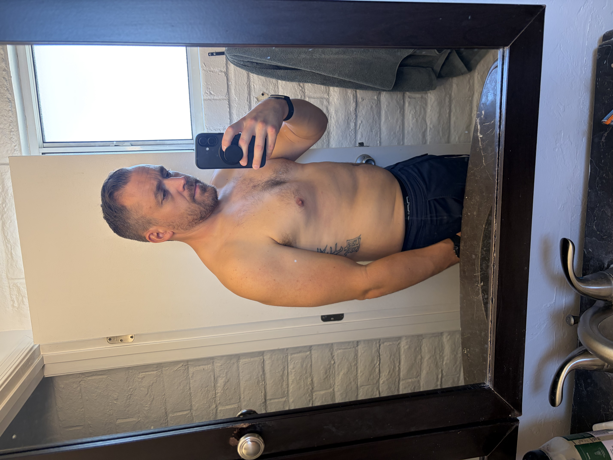

# 

Starting weight: 197lbs
Goal weight: 170lbs
Time Frame: 12 weeks
Rate of loss: 2lbs/week
Before pics:
08-18-2026 at 197 lbs

Hairline pic

After pics:

Strength:
Squat:
Bench:
Deadlift:
Overhead press:

Pullups:
Pushups:
Dips:
Lunges:
HLR:
GHR:
Ab Wheel:

Cardio:

Before HRV: 61
RHR: 47
BOLT: 14
Max Breath hold: 1:18
Total Testosterone: 532 NG/dL
Free Testosterone: 90.1 pg/mL
Body Fat%: ~27%
HDL: 49 mg/dl
LDL:  93 mg/dl
7 day average sleep hours: 5:50
Caffeine: 355

Measurements:
Biceps:
Forearms:
Waist:
Thighs:
Calves:
Chest:
Neck:
## My Routine: 

Strength Program: 
5/3/1 4x per week.
Calisthenic accessories 

Cardio:
Walking dog
Stair master start with 5 minutes after each workout at 20 minutes a week total. 
Yard work
Trampoline

Caffeine -5mg per day.
10-6 eating window.